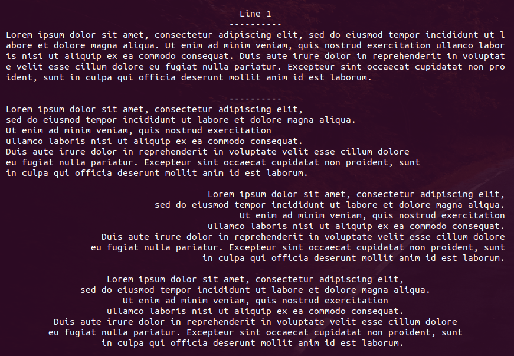
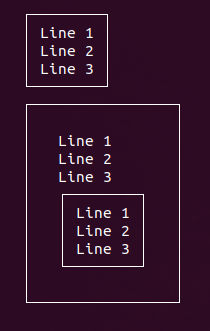
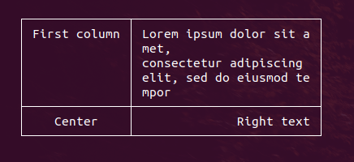
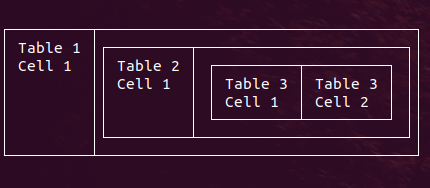

**Frames-console**

[](https://packagist.org/packages/vpa/frames-console) [](https://packagist.org/packages/vpa/frames-console) [](https://packagist.org/packages/vpa/frames-console) [](https://packagist.org/packages/vpa/frames-console) [](https://packagist.org/packages/vpa/frames-console)

A flexible set of components that allow you to frame various content in the console. Supports the display of text, block elements and tables, including nested ones.

**Install**
```
composer require vpa/frames-console
```

**Get Started**

If you want to display multiple elements - we recommend using the Page root element.
You can initialize the first element yourself:
```
use VPA\Console\Shell;
use VPA\Console\FrameConsoleConfig;
use VPA\Console\Glyphs\Page;

require_once(__DIR__ . '/../vendor/autoload.php');

$shell = new Shell();
$config = new FrameConsoleConfig($shell);
$page = new Page($config);
```
or use DI Container:
```
use VPA\DI\Container;
use VPA\Console\FrameConsoleConfig;
use VPA\Console\Glyphs\Page;

require_once(__DIR__ . '/../vendor/autoload.php');

$di = new Container();
$di->registerContainers([
    'VPA\Console\FrameConfigInterface' => FrameConsoleConfig::class,
]);

$page = $di->get(Page::class);
```

**Output text**

Not the most useful application, but why not?

We assume that you have already initialized the element in the previous paragraph.

Examples:
```
$documentWidth = $page->getDocumentWidth();

// Single short line
$page->addText()->setValue("Line 1");
$page->addText()->setValue("----------");
// One long line with a length limit of up to screen width
$page->addText(['maxWidth'=>$documentWidth])->setValue("Lorem ipsum dolor sit amet, consectetur adipiscing elit, sed do eiusmod tempor incididunt ut labore et dolore magna aliqua. Ut enim ad minim veniam, quis nostrud exercitation ullamco laboris nisi ut aliquip ex ea commodo consequat. Duis aute irure dolor in reprehenderit in voluptate velit esse cillum dolore eu fugiat nulla pariatur. Excepteur sint occaecat cupidatat non proident, sunt in culpa qui officia deserunt mollit anim id est laborum.\n");
$page->addText()->setValue("----------");
// Multiline long line with a length limit of up to default maxWidth and with new line symbols
$text = $page->addText()->setValue("Lorem ipsum dolor sit amet, consectetur adipiscing elit,\n sed do eiusmod tempor incididunt ut labore et dolore magna aliqua.\nUt enim ad minim veniam, quis nostrud exercitation\n ullamco laboris nisi ut aliquip ex ea commodo consequat.\n Duis aute irure dolor in reprehenderit in voluptate velit esse cillum dolore\n eu fugiat nulla pariatur. Excepteur sint occaecat cupidatat non proident, sunt\n in culpa qui officia deserunt mollit anim id est laborum.\n");
$page->display();
```
You can see:


Text element supports the attribute __textAlign__: left (default), center, right.

Example:
```
// Single short line
$page->addText(['maxWidth' => 100, 'textAlign' => 'center'])->setValue("Line 1");
$page->addText(['maxWidth' => 100, 'textAlign' => 'center'])->setValue("----------");
// One line with a length limit of to 100 characters
$page->addText(['maxWidth' => 100])->setValue("Lorem ipsum dolor sit amet, consectetur adipiscing elit, sed do eiusmod tempor incididunt ut labore et dolore magna aliqua. Ut enim ad minim veniam, quis nostrud exercitation ullamco laboris nisi ut aliquip ex ea commodo consequat. Duis aute irure dolor in reprehenderit in voluptate velit esse cillum dolore eu fugiat nulla pariatur. Excepteur sint occaecat cupidatat non proident, sunt in culpa qui officia deserunt mollit anim id est laborum.\n");
$page->addText(['maxWidth' => 100, 'textAlign' => 'center'])->setValue("----------");
// Multiline line with a length limit of up to 100 characters and with new line symbols
$text = $page->addText(['maxWidth' => 100])->setValue("Lorem ipsum dolor sit amet, consectetur adipiscing elit,\n sed do eiusmod tempor incididunt ut labore et dolore magna aliqua.\nUt enim ad minim veniam, quis nostrud exercitation\n ullamco laboris nisi ut aliquip ex ea commodo consequat.\n Duis aute irure dolor in reprehenderit in voluptate velit esse cillum dolore\n eu fugiat nulla pariatur. Excepteur sint occaecat cupidatat non proident, sunt\n in culpa qui officia deserunt mollit anim id est laborum.\n");
// TextAlign right
$text = $page->addText(['textAlign' => 'right', 'maxWidth' => 100])->setValue("Lorem ipsum dolor sit amet, consectetur adipiscing elit,\n sed do eiusmod tempor incididunt ut labore et dolore magna aliqua.\nUt enim ad minim veniam, quis nostrud exercitation\n ullamco laboris nisi ut aliquip ex ea commodo consequat.\n Duis aute irure dolor in reprehenderit in voluptate velit esse cillum dolore\n eu fugiat nulla pariatur. Excepteur sint occaecat cupidatat non proident, sunt\n in culpa qui officia deserunt mollit anim id est laborum.\n");
// TextAlign center
$text = $page->addText(['textAlign' => 'center', 'maxWidth' => 100])->setValue("Lorem ipsum dolor sit amet, consectetur adipiscing elit,\n sed do eiusmod tempor incididunt ut labore et dolore magna aliqua.\nUt enim ad minim veniam, quis nostrud exercitation\n ullamco laboris nisi ut aliquip ex ea commodo consequat.\n Duis aute irure dolor in reprehenderit in voluptate velit esse cillum dolore\n eu fugiat nulla pariatur. Excepteur sint occaecat cupidatat non proident, sunt\n in culpa qui officia deserunt mollit anim id est laborum.\n");

$page->display();
```



**DIV elements**

Div element - it is simple method add paddings or borders. Any block element (table, cell, div) have methods:
```
setPadding(left, right, top, bottom); // can take any positive int values
setBorder(left, right, top, bottom); // can take values 0 or 1
```

Example:
```
// Single Div
$div = $page->addDiv()->setPadding(1, 1, 0, 0)->setBorder(1, 1, 1, 1)->addText()->setValue("Line 1\nLine 2\nLine 3");
// Div with text and another div
$div = $page->addDiv()->setPadding(3, 3, 1, 1)->setBorder(1, 1, 1, 1);
$div->addText()->setValue("Line 1\nLine 2\nLine 3");
$div2 = $div->addDiv()->setPadding(1, 1, 0, 0)->setBorder(1, 1, 1, 1);
$div2->addText()->setValue("Line 1\nLine 2\nLine 3");

$page->display();
```

Result:



**Table**

Example of table with different aligns for text, limitation of max length of cell, long string with new lines, borders and paddings:
```$table = $page->addTable()->setBorder(1, 1, 1, 1);
    $row = $table->addRow();
    $row->addCell()
        ->setPadding(1, 1, 0, 0)
        ->setBorder(0, 1, 0, 1)
        ->addText()->setValue("First column");
    $row->addCell()
        ->setPadding(1, 1, 0, 0)
        ->setBorder(0, 0, 0, 1)
        ->addText(['maxWidth' => 25])
        ->setValue("Lorem ipsum dolor sit amet,\n consectetur adipiscing elit, sed do eiusmod tempor");
    $row2 = $table->addRow();
    $row2->addCell()
        ->setPadding(1, 1, 0, 0)
        ->setBorder(0, 1, 0, 0)
        ->addText(['textAlign' => 'center'])->setValue("Center");
    $row2->addCell()
        ->setPadding(1, 1, 0, 0)
        ->setBorder(0, 0, 0, 0)
        ->addText(['textAlign' => 'right'])->setValue("Right text");
    $page->display();
```

Result:



Like DIV, table supports nested calls. You can just do it:
```
$table = $page->addTable()->setBorder(1, 1, 1, 1);
$row = $table->addRow();
$row->addCell()->setPadding(1, 1, 0, 0)->setBorder(0, 1, 0, 0)->addText()->setValue("Table 1\nCell 1");
$cell1 = $row->addCell()->setPadding(0, 0, 0, 0);
$table2 = $cell1->addTable()->setBorder(1, 1, 1, 1);
$row2 = $table2->addRow();
$row2->addCell()->setPadding(1, 1, 0, 0)->setBorder(0, 1, 0, 0)->addText()->setValue("Table 2\nCell 1");
$cell2 = $row2->addCell()->setPadding(1, 1, 0, 0)->setBorder(0, 0, 0, 0);
$table3 = $cell2->addTable()->setBorder(1, 1, 1, 1);
$row3 = $table3->addRow();
$row3->addCell()->setPadding(1, 1, 0, 0)->setBorder(0, 1, 0, 0)->addText()->setValue("Table 3\nCell 1");
$row3->addCell()->setPadding(1, 1, 0, 0)->setBorder(0, 0, 0, 0)->addText()->setValue("Table 3\nCell 2");

$page->display();
```

And get it:


