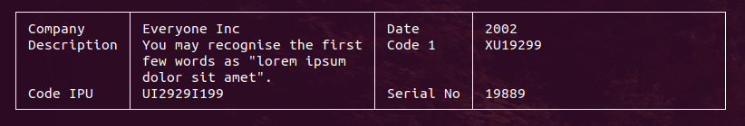

Simple use without any attributes:

```
$data = [
        'Company' => 'Everyone Inc',
        'Date' => '2002',
        'Description' => 'You may recognise the first few words as "lorem ipsum dolor sit amet".',
        'Code 1' => 'XU19299',
        'Code IPU' => 'UI2929I199',
        'Serial No' => '19889',
    ];
$table1d = new Table1D($config);
$table1d->output($data);
```

