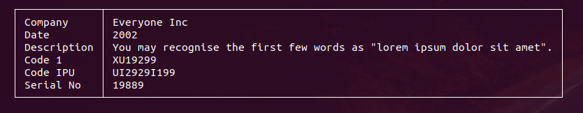
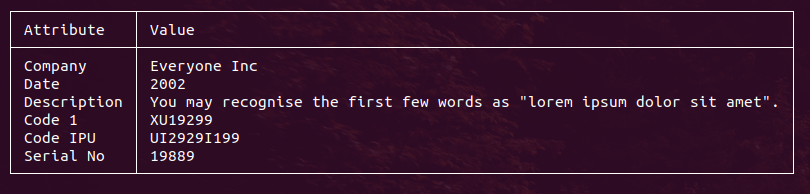
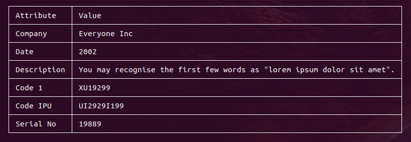
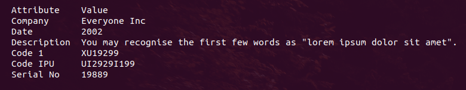
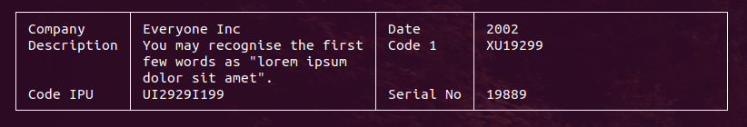
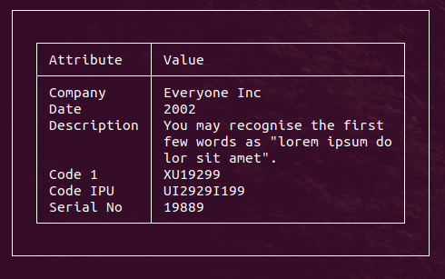

Simple use without any attributes:

```
$data = [
        'Company' => 'Everyone Inc',
        'Date' => '2002',
        'Description' => 'You may recognise the first few words as "lorem ipsum dolor sit amet".',
        'Code 1' => 'XU19299',
        'Code IPU' => 'UI2929I199',
        'Serial No' => '19889',
    ];
$table1d = new Table1D($config);
$table1d->output($data);
```

Output(first column - key of array, second - value):



---

Table1D with Header row:
```
$table1d = (new Table1D($config))->setHeader("Attribute", "Value");
// we use $data from prevoius example
$table1d->output($data);
```



The default display type is slim (the frame is only around the entire table and title bar). 
You can use types: 
1. "frame" - frame around each cell
2. "frameless" - the frame is not shown

How to set type:

```
$table1d = (new Table1D($config))
        ->setConfig(['type' => TableDisplayMode::Frame,])
        ->setHeader("Attribute", "Value");
$table1d->output($data);
```

Result:



---

**Type=Frameless**

```
$table1d = (new Table1D($config))
        ->setConfig(['type' => TableDisplayMode::Frameless,])
        ->setHeader("Attribute", "Value");
$table1d->output($data);
```


Other supported attributes for Table1D:

| Attribute | Default value | Values | Description |
--- | --- | --- | ---
type | TableDisplayMode::Slim | Slim, Frame, Frameless | Describes how show frames for table
columns | '1' | 'auto' [^1], positive int(2,3,4...) | Pack data into multiple columns
firstColumnWidth | 'auto' | 'auto', positive int(2,3,4...) | Width of first column in symbols
firstColumnMaxWidth | 'auto' | 'auto', positive int(2,3,4...) | Width of second column in symbols
secondColumnWidth | 'auto' | 'auto', positive int(2,3,4...) | Max width of first column in symbols (if the content length is less than the maximum width - the cell size is equal to the actual content length)
secondColumnMaxWidth | 'auto' | 'auto', positive int(2,3,4...) | Max width of second column in symbols (if the content length is less than the maximum width - the cell size is equal to the actual content length)

Examples:
```
$table1d = (new Table1D($config))
        ->setConfig([
                'columns'=>2,
                'secondColumnWidth' => 30,
                ]);
$table1d->output($data);
```



---

**Use Table1D with other elements**

You can add Table1D to any GlyphBlock elements (DIV, Table, Page) and it works.

Full example for Table1D inside DIV element (DIV attached to Page):
```
$page = (new Page($config))->setPadding(3, 3, 3, 3);
$data = [
        'Company' => 'Everyone Inc',
        'Date' => '2002',
        'Description' => 'You may recognise the first few words as "lorem ipsum dolor sit amet".',
        'Code 1' => 'XU19299',
        'Code IPU' => 'UI2929I199',
        'Serial No' => '19889',
];

$div = $page->addDiv()->setBorder(1, 1, 1, 1)->setPadding(2, 2, 1, 1);
$table1d = (new Table1D($config))
        ->setConfig(['secondColumnWidth' => 30,])
        ->setHeader("Attribute", "Value");
$div->addChild($table1d);
$table1d->setData($data);
$page->display();
```

**Output:**



[^1]: for using columns: 'auto', you must attach Table1D to the Page element. This is because the method for getting the terminal width is only available on the Page element, and this value is used to calculate the number of columns.
